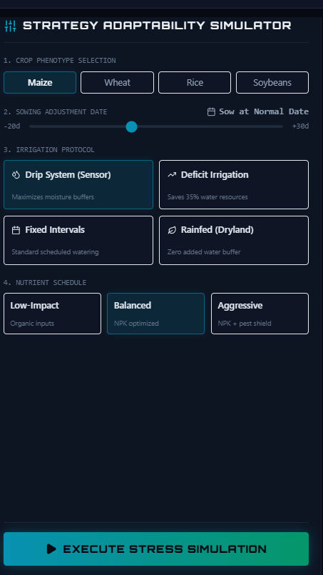
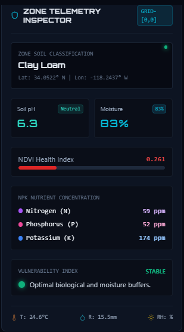
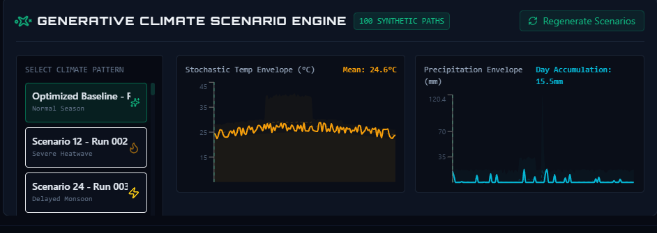
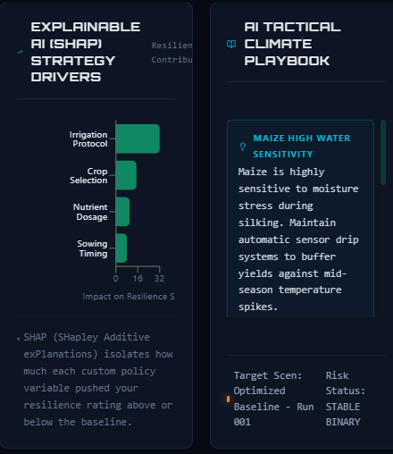
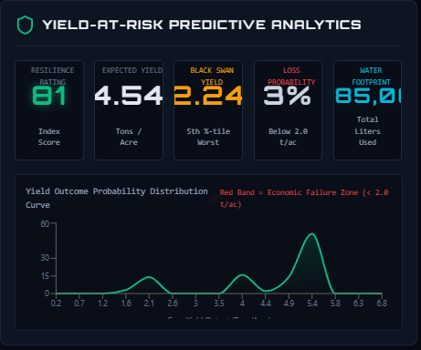
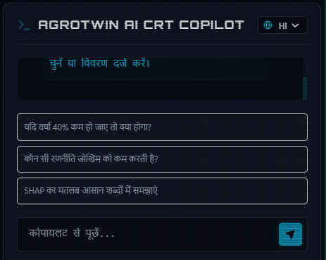
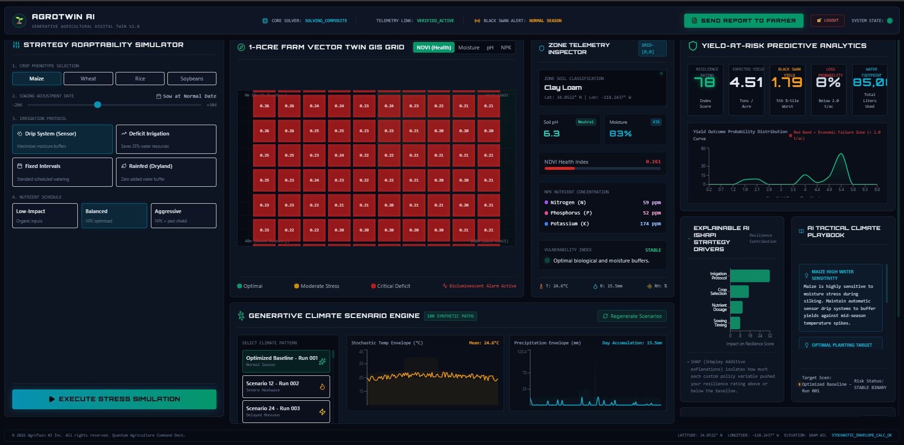
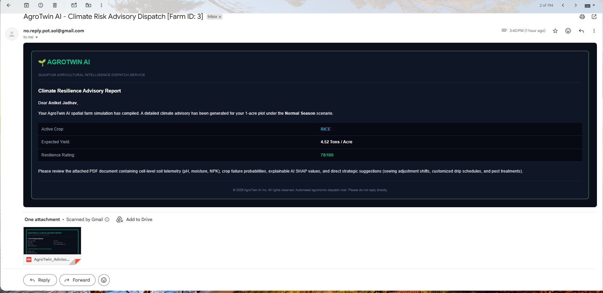
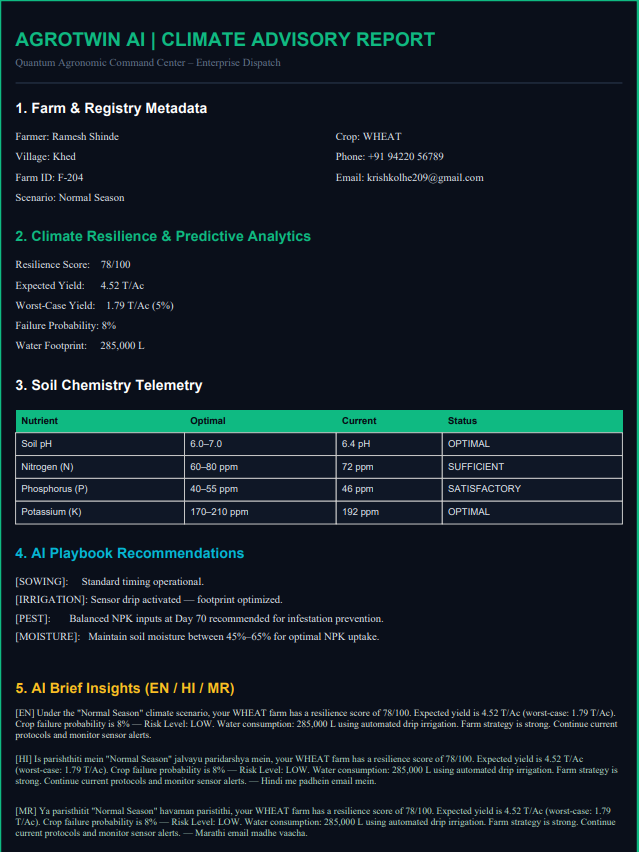

# AgroTwin AI
## Generative Digital Twins for Stochastic Crop Resilience & Predictive Climate-Risk Playbook Generation

AgroTwin AI is an advanced AI-powered climate resilience platform designed to help farmers prepare for unpredictable climate events using Generative Digital Twins, stochastic climate simulations, satellite intelligence, and AI-driven decision support systems.

The platform creates a live virtual replica (Digital Twin) of a farm and stress-tests it against 50+ synthetic future climate scenarios such as droughts, floods, heatwaves, delayed monsoons, and pest outbreaks.

Instead of predicting only one possible future, AgroTwin AI simulates multiple probabilistic futures and recommends the safest farming strategy with the highest resilience and lowest yield risk.

---

# Problem Statement

Traditional farming relies heavily on historical weather averages and static advisory systems. However, climate change has introduced extreme “Black Swan” events such as:

- Sudden heatwaves
- Flash floods
- Delayed rainfall
- Extended droughts
- Pest outbreaks
- Soil degradation

Current agricultural monitoring systems only tell farmers:
> “What is happening now.”

They fail to answer:
> “What could happen next?”

AgroTwin AI solves this problem by introducing:
- Generative climate simulation
- AI-powered scenario analysis
- Digital farm twins
- Yield-at-Risk analytics
- Climate-resilient strategy recommendations

---

# Project Objectives

## Primary Goals

- Build a Digital Twin of a farm plot
- Simulate 50–100 future climate scenarios
- Predict yield and climate risks
- Optimize irrigation and fertilizer strategies
- Provide AI-generated resilience playbooks
- Deliver detailed reports directly to farmers

---

# Key Features

# 1. Generative Digital Twin

Create a real-time virtual replica of a physical farm using:
- Soil sensor data
- Satellite imagery
- Weather APIs
- Farmer inputs

The digital twin continuously monitors:
- Soil moisture
- pH levels
- NPK values
- Humidity
- Temperature
- Crop growth stage
- Irrigation status
- Vegetation health

---

# 2. Stochastic Climate Scenario Generation

Generate 50–100 synthetic future weather trajectories using AI and probabilistic modeling.

## Simulated Events
- Heatwaves
- Droughts
- Floods
- Delayed monsoons
- Water shortages
- Pest outbreaks
- Sudden temperature shifts

## AI Techniques Used
- Monte Carlo Simulation
- Time-Series Forecasting
- Variational Autoencoders (VAE)
- GAN-based Weather Generation
- Diffusion-based Climate Simulation

---

# 3. Strategy Simulation Engine

The system automatically tests multiple farming strategies across all generated climate scenarios.

## Strategy Parameters
- Sowing dates
- Irrigation schedules
- Fertilizer plans
- Crop selection
- Water usage optimization

The platform evaluates:
- Yield performance
- Resource usage
- Risk score
- Survival probability

---

# 4. Yield-at-Risk (YaR) Analytics

AgroTwin AI provides:
- Expected yield
- Worst-case yield
- Best-case yield
- Failure probability
- Climate resilience score
- Water consumption metrics

This helps farmers choose:
> The safest strategy instead of only the highest-yield strategy.

---

# 5. AI Climate Playbook

The AI generates an actionable resilience playbook for farmers.

## Example Recommendations
- Delay sowing by 10 days
- Reduce irrigation during low-rainfall weeks
- Use drip irrigation
- Increase potassium levels
- Apply pest-control measures before week 5

---

# 6. AI Farmer Copilot

Integrated LLM-powered assistant for natural language interaction.

## Farmers Can Ask
- “What if rainfall reduces by 40%?”
- “Which strategy minimizes risk?”
- “Will heatwaves affect my crop?”
- “How much irrigation is needed next week?”

## Features
- Multilingual support
- Voice-enabled responses
- Simplified AI explanations

---

# 7. Satellite Intelligence Module

Uses satellite imagery to monitor:
- Vegetation health
- Water stress
- Crop growth
- Soil moisture trends

## Data Sources
- Sentinel-2
- NASA POWER
- NDVI datasets
- Remote sensing APIs

---

# 8. AI Report Generation System

Generate detailed PDF reports containing:
- Farm insights
- Climate-risk analysis
- Scenario simulation results
- Yield predictions
- Soil health analytics
- Irrigation recommendations
- Risk heatmaps
- AI-generated suggestions

---

# 9. Farmer Report Delivery System

The analyzer dashboard includes:
- “Send Report to Farmer” button
- Farmer selection popup
- Email verification system
- Dynamic report delivery
- Delivery status tracking

## Workflow
1. Analyzer clicks “Send Report”
2. Farmer list appears
3. Farmer is selected
4. Email ID is displayed or entered manually
5. AI-generated report is emailed instantly

---

# 10. Notification & Advisory System

Track:
- Sent reports
- Failed deliveries
- Read/unread reports
- Pending advisories
- Climate warnings

---


# System Architecture

```text
+---------------------------------------------------------------+
|                    External Data Sources                      |
+---------------------------------------------------------------+
|                                                               |
|  • Soil Sensors (pH, NPK, Moisture, Temperature)              |
|  • Weather APIs (Rainfall, Humidity, Heatwave Alerts)         |
|  • Satellite Imagery (NDVI, Crop Health, Water Stress)        |
|  • Farmer Inputs (Crop Type, Sowing Date, Irrigation Plan)    |
|                                                               |
+-----------------------------+---------------------------------+
                              |
                              v
+---------------------------------------------------------------+
|                   Digital Twin Engine                         |
+---------------------------------------------------------------+
| Creates a real-time virtual replica of the farm plot using:   |
|                                                               |
|  • Sensor Data Fusion                                         |
|  • Soil Health Monitoring                                     |
|  • Crop Growth Tracking                                       |
|  • Environmental Monitoring                                   |
|                                                               |
+-----------------------------+---------------------------------+
                              |
                              v
+---------------------------------------------------------------+
|             Generative Climate Simulation Engine              |
+---------------------------------------------------------------+
| Generates 50–100 synthetic future climate scenarios using:    |
|                                                               |
|  • Monte Carlo Simulation                                     |
|  • Time-Series Forecasting                                    |
|  • GAN / VAE-based Weather Generation                         |
|  • Diffusion-based Scenario Modeling                          |
|                                                               |
| Simulates:                                                    |
|  • Droughts                                                   |
|  • Floods                                                     |
|  • Heatwaves                                                  |
|  • Delayed Monsoons                                           |
|  • Pest Outbreaks                                             |
|                                                               |
+-----------------------------+---------------------------------+
                              |
                              v
+---------------------------------------------------------------+
|                 Strategy Simulation Engine                    |
+---------------------------------------------------------------+
| Tests multiple farming strategies against all generated       |
| climate scenarios.                                            |
|                                                               |
| Strategies Include:                                           |
|  • Different sowing dates                                     |
|  • Irrigation schedules                                       |
|  • Fertilizer plans                                           |
|  • Crop selection                                             |
|                                                               |
+-----------------------------+---------------------------------+
                              |
                              v
+---------------------------------------------------------------+
|                  Yield-at-Risk Analytics                      |
+---------------------------------------------------------------+
| Calculates:                                                   |
|                                                               |
|  • Expected Yield                                              |
|  • Failure Probability                                         |
|  • Water Consumption                                           |
|  • Profit/Loss Estimation                                      |
|  • Climate Resilience Score                                    |
|                                                               |
+-----------------------------+---------------------------------+
                              |
                              v
+---------------------------------------------------------------+
|                 AI Climate Playbook Generator                 |
+---------------------------------------------------------------+
| Generates actionable AI recommendations such as:              |
|                                                               |
|  • Delay sowing by 10 days                                    |
|  • Reduce irrigation during drought weeks                     |
|  • Use drip irrigation                                        |
|  • High pest outbreak warning                                 |
|                                                               |
+-----------------------------+---------------------------------+
                              |
                              v
+---------------------------------------------------------------+
|             Farmer Dashboard & Report System                  |
+---------------------------------------------------------------+
|  • Interactive Dashboard                                      |
|  • Risk Heatmaps                                              |
|  • Climate Scenario Visualization                             |
|  • AI Copilot Chatbot                                         |
|  • PDF Report Generation                                      |
|  • Email Notification System                                  |
|  • Farmer Advisory Reports                                    |
+---------------------------------------------------------------+
````

---

# Tech Stack

## Frontend Technologies

The frontend is designed as a futuristic AI-powered agricultural dashboard.

### Technologies Used

* **React.js** → Component-based frontend development
* **Next.js** → Server-side rendering and optimized routing
* **Tailwind CSS** → Modern responsive UI styling
* **Framer Motion** → Smooth animations and transitions
* **Recharts** → Interactive graphs and analytics charts
* **Mapbox / Leaflet** → GIS mapping and satellite visualization

---

## Backend Technologies

The backend handles APIs, AI orchestration, report generation, and system communication.

### Technologies Used

* **FastAPI** → High-performance Python backend APIs
* **Node.js** → Real-time services and email delivery
* **Flask** → Lightweight ML microservices

---

## AI / Machine Learning Stack

The AI layer powers climate simulation, prediction, and optimization.

### Frameworks & Libraries

* **TensorFlow** → Deep learning models
* **PyTorch** → Neural network experimentation
* **Scikit-learn** → Traditional ML models
* **XGBoost** → Yield prediction and risk scoring
* **Stable-Baselines3** → Reinforcement learning for irrigation optimization

---

## Database Technologies

### Databases Used

* **PostgreSQL + PostGIS**

  * Geospatial farm data storage
  * GIS mapping support

* **MongoDB**

  * Flexible AI-generated scenario storage
  * Semi-structured analytics data

* **InfluxDB**

  * Real-time sensor and IoT time-series data

---

## External APIs & Data Sources

### Weather APIs

* OpenWeatherMap API
* NASA POWER API

### Satellite & Remote Sensing APIs

* Sentinel-2 Satellite APIs
* NDVI datasets
* Remote sensing imagery

---


# AI Models Used

| Module                      | AI/ML Model Used                        | Purpose                                       |
| --------------------------- | --------------------------------------- | --------------------------------------------- |
| Weather Scenario Generation | TimeGAN / Variational Autoencoder (VAE) | Generate synthetic future climate conditions  |
| Yield Prediction            | XGBoost / LSTM                          | Predict crop yield under different scenarios  |
| Soil Health Analysis        | Random Forest                           | Analyze soil quality and nutrient balance     |
| Pest & Disease Prediction   | CNN + Weather Features                  | Predict pest outbreaks and crop disease risks |
| Climate Risk Assessment     | Bayesian Networks                       | Calculate farming risk probabilities          |
| Irrigation Optimization     | Reinforcement Learning                  | Optimize water usage dynamically              |
| Climate Simulation          | Monte Carlo Simulation                  | Generate stochastic future climate events     |

---

# Project Structure

```text
AgroTwin-AI/
│
├── backend/
│   │
│   ├── .env.example              # Example environment variables
│   ├── main.py                   # FastAPI backend entry point
│   ├── ml_engine.py              # AI/ML prediction engine
│   └── schema.sql                # Database schema
│
├── public/                       # Static public assets
│
├── src/                          # Frontend source code
│   │
│   ├── components/               # Reusable UI components
│   ├── pages/                    # Application pages
│   ├── dashboard/                # Dashboard modules
│   ├── charts/                   # Graph and analytics components
│   ├── maps/                     # GIS and satellite map modules
│   ├── services/                 # API integration services
│   ├── hooks/                    # Custom React hooks
│   ├── utils/                    # Helper functions and utilities
│   └── styles/                   # Styling and Tailwind CSS files
│
├── .gitignore                    # Git ignored files and folders
├── eslint.config.js              # ESLint configuration
├── index.html                    # Main frontend entry HTML
├── package.json                  # Node.js dependencies and scripts
├── package-lock.json             # Dependency lock file
├── postcss.config.js             # PostCSS configuration
├── README.md                     # Project documentation
├── tailwind.config.js            # Tailwind CSS configuration
└── vite.config.js                # Vite build configuration
```

---

# Installation Guide

## 1. Clone the Repository

```bash
git clone https://github.com/your-username/agrotwin-ai.git

cd agrotwin-ai
```

---

## 2. Frontend Setup

```bash
cd frontend

npm install

npm run dev
```

The frontend will run at:

```text
http://localhost:3000
```

---

## 3. Backend Setup

```bash
cd backend

pip install -r requirements.txt

uvicorn main:app --reload
```

The backend server will run at:

```text
http://localhost:8000
```

---

# Environment Variables

Create a `.env` file in the root directory:

```env
OPENWEATHER_API_KEY=your_api_key
NASA_API_KEY=your_api_key
EMAIL_USERNAME=your_email
EMAIL_PASSWORD=your_password
DATABASE_URL=your_database_url
MAPBOX_TOKEN=your_mapbox_token
```

---


# Innovation Highlights

## What Makes AgroTwin AI Unique?

Unlike traditional agricultural monitoring systems, AgroTwin AI:

* Generates synthetic future climate scenarios
* Simulates extreme climate stress conditions
* Tests multiple farming strategies automatically
* Predicts Yield-at-Risk instead of static yield
* Provides resilience-focused farming recommendations

This creates:

> “Climate Stress Testing for Agriculture.”

---

## Screenshots

### Strategy Adaptability Simulator


### Health Index


### Scenario Engine


### Strategy Map


### Yield at risk


### AI Chatbot


### Dashboard


### Email Report


### Farm Report



# License

> This project is licensed under the MIT License.


